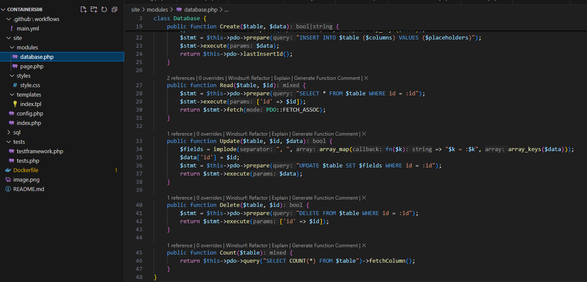
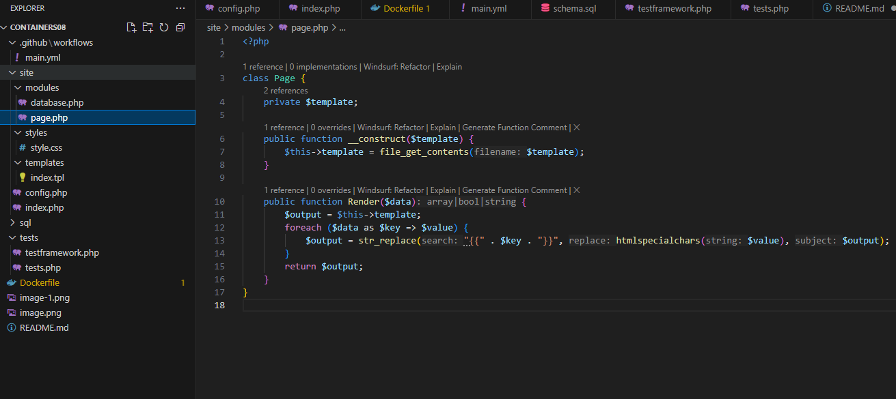
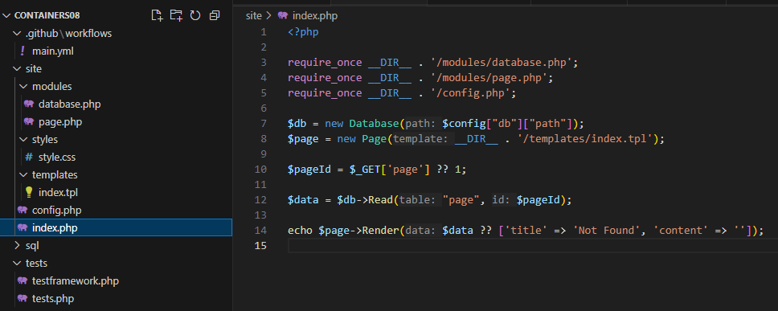
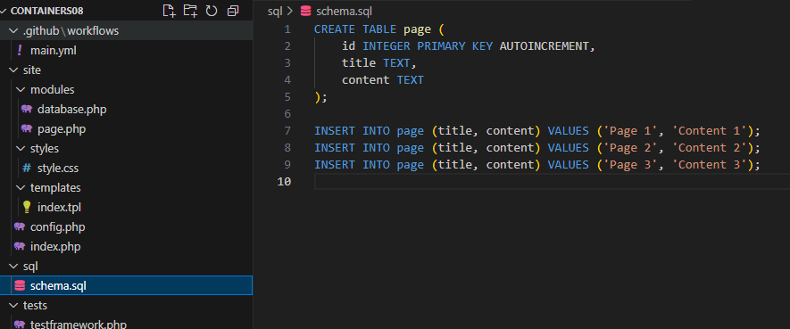
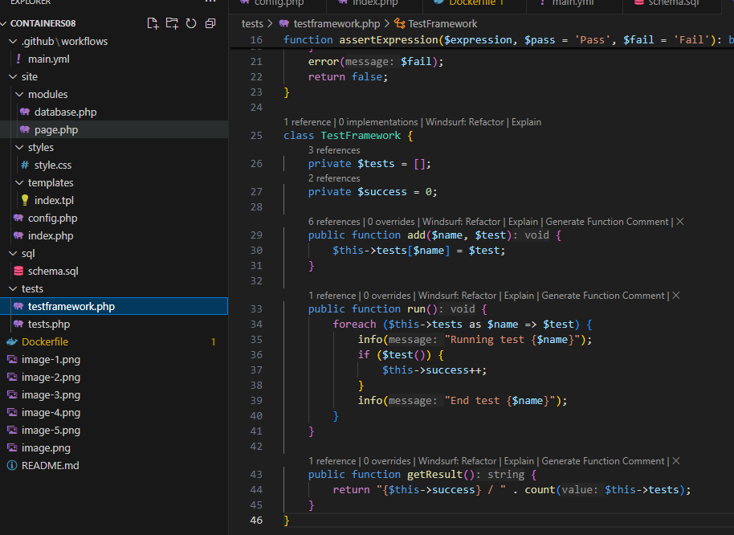
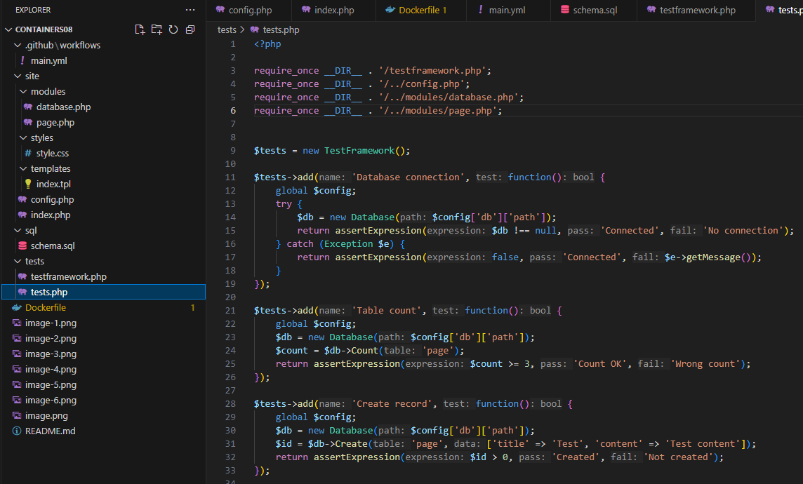
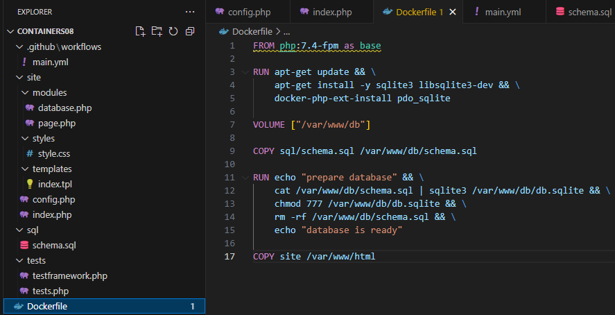
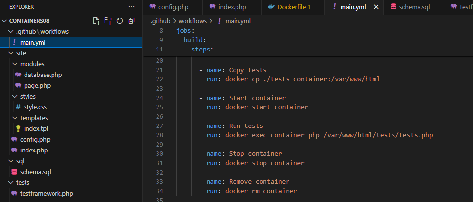
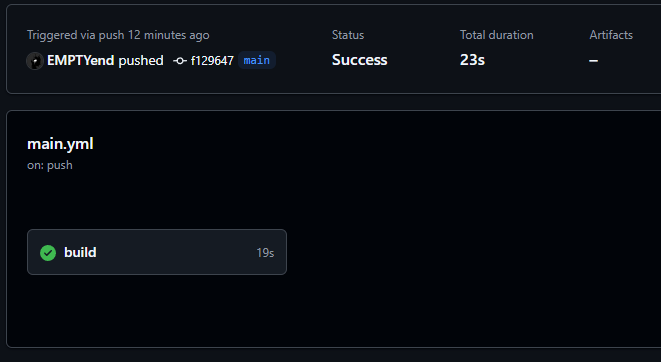

# Лабораторная работа №8

## Цель работы

В рамках данной работы студенты научатся настраивать непрерывную интеграцию с помощью Github Actions.

## Задание

Создать Web приложение, написать тесты для него и настроить непрерывную интеграцию с помощью Github Actions на базе контейнеров.

## Выполнение работы

### 1. Структура проекта

### 2. Описание компонентов

#### Web-приложение

- `modules/database.php` — содержит класс `Database` для работы с SQLite.

- `modules/page.php` — содержит класс `Page` для шаблонизации страницы.

- `config.php` — конфигурация с путем к базе данных.

- `index.php` — основной файл для отображения страницы по ID.

#### База данных

- `sql/schema.sql` — SQL-скрипт создаёт таблицу `page` и добавляет 3 записи.

#### Тесты

- `tests/testframework.php` — минималистичный тестовый фреймворк.
- 
- `tests/tests.php` — набор юнит-тестов для проверки методов `Database` и `Page`.
- 

#### Docker

- `Dockerfile` — собирает образ на базе `php:7.4-fpm`, устанавливает SQLite, копирует код и инициализирует базу.

#### GitHub Actions

- `.github/workflows/main.yml` — конфигурация CI: собирает контейнер, запускает, прогоняет тесты, затем удаляет.

- 

- 
## Ответы на вопросы

## Что такое непрерывная интеграция?

**Непрерывная интеграция (CI)** — это практика автоматического тестирования и сборки кода каждый раз при внесении изменений (например, после `push` или `pull request`). Она помогает быстро обнаруживать ошибки и поддерживать стабильность проекта.

## Для чего нужны юнит-тесты? Как часто их нужно запускать?

**Юнит-тесты** позволяют проверять корректность отдельных функций и методов в изоляции. Их нужно запускать:

- При каждом коммите (в идеале — автоматически через CI).
- При добавлении или изменении логики.
- Перед релизом.

## Что нужно изменить в `.github/workflows/main.yml`, чтобы тесты запускались при каждом Pull Request?

### Нужно добавить `pull_request` в секцию `on`:

on:
  push:
    branches:
      - main
  pull_request:
    branches:
      - main

## Что нужно добавить в .github/workflows/main.yml, чтобы удалять созданные образы после выполнения тестов?
Добавить шаг очистки в конце workflow:

- name: Remove Docker image
  run: docker rmi containers08 || true
Или — сделать это только при успешном завершении:

- name: Remove Docker image
  if: success()
  run: docker rmi containers08
  
  # Выводы
В ходе лабораторной работы был реализован простой контейнеризированный PHP-сайт с использованием SQLite, написаны юнит-тесты и настроена автоматическая проверка через GitHub Actions. Это позволило понять, как CI помогает поддерживать качество кода и ускоряет процесс разработки.